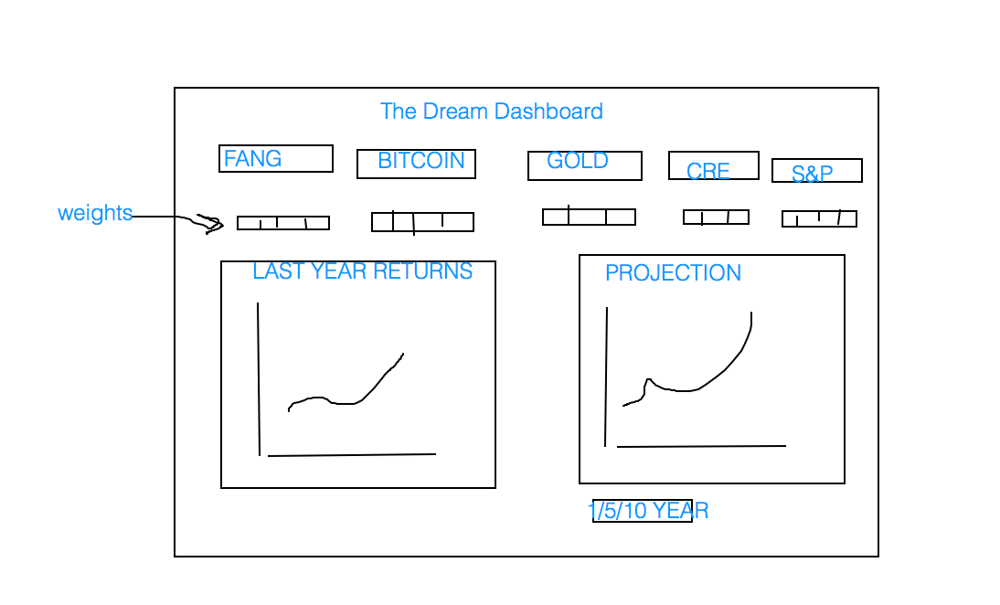

# The Dream Dashboard

## Members:

*Ryan Resiner, Chinedozi Eronini, Jorge Abud, Mark Murdock, and Katie Funk*

## Purpose: 

*Bringing together the wildly disparate data of the investment world into a one-stop-shop interactive dashboard!*

## What Problem are we solving?

Building portfolios is difficult and time consuming. The amount of grunt work necessary in order to cross reference stock prices, alternative investments, and other commodities can be a daunting task. 

## What Research Questions do we have?

*-which asset holds the most promise as a store of value?*

*-which asset class is the most/least volatile?**

-how does rebalancing affect the portfolio over an extended period?*

*-is it possible to create a portfolio with correlation under .15 using the options below?*

## What are we Offering: 

*An interactive dashboard that allows the end user to build a personalized portfolio. Using the last ten years of data, we will be able to show the reader the current value of their portfolio (had they invested 10 years ago) and be able to roughly project over the next 1,5,10 years. Furthermore, we will be able to compare/contrast their portfolio instantly with tabs/sliders/etc, allowing the end user to see the differences in the portfolio with rebalancing/periodic investment (instead of lump sum)/ etc.*

*We will also show the best case scenario vs worst case scenario of investments over the last 10 years.*

## What Data are we using?

*-Bitcoin*

*-S&P 500*

*-FANG Stocks*

*-Art ETF*

*-Real Estate ETF*

*-Gold ETF*

## Rough Sketch



## Breakdown of Tasks

1. Start pulling and cleaning data:
    
    *pull for 10 years*
    
    Katie: Vanguard ETF

    Jorge: FANG data

    Mark: Gold

    Chinedozi: Cryptos (start with Bitcoin)
    
    Ryan: S&P 500 data


2. Organize data into the same format

datetime_index, "Ticker" (with price underneath), daily_returns

created the universal dataframe

2b. How to format universal dataframe into good data for projections/graphs

3. Projections

4. Build Graphs as hvplots

5. Start messing with dashboards

Finished Product Must Have: 

- two datasets, cleaned and formatted
- exploration + cleanup process
- create a jupyter notebook and format
- aggregate visuals with final analysis
- optional API
- us one new Python Library
- 10 new library


```
First Draft:

Brainstorming:
The Ultimate Portfolio(since 2010): CREATING A HEDGEFUND
Commercial real estate, industrial, residential
Bitcoin, crptos, forex?
Gold/silver/platinum
S&P/NASDAQ/russell index/
FANG stocks


Portfolio Balancing Dashboard

Process: 
Compare each asset class within itself over the last 10 years

Combine the “winners” of each asset class into a portfolio

Find the most efficient weights/correlations to balance portfolio

Create a prediction for the next 1,5,10  years (Monte Carlo of best performing asset class)

End Game: badass dashboard


Description/Outline:
-best store of value
-diversification at its finest ---> how do we make the most diversified portfolio?

